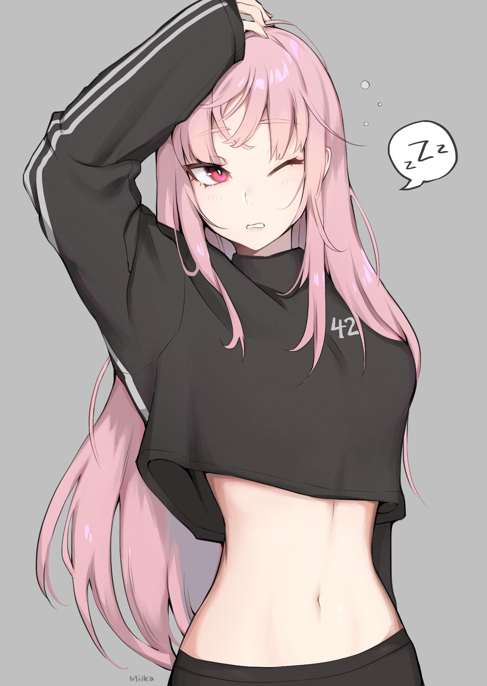
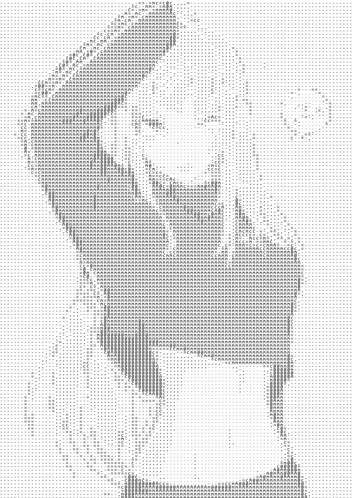
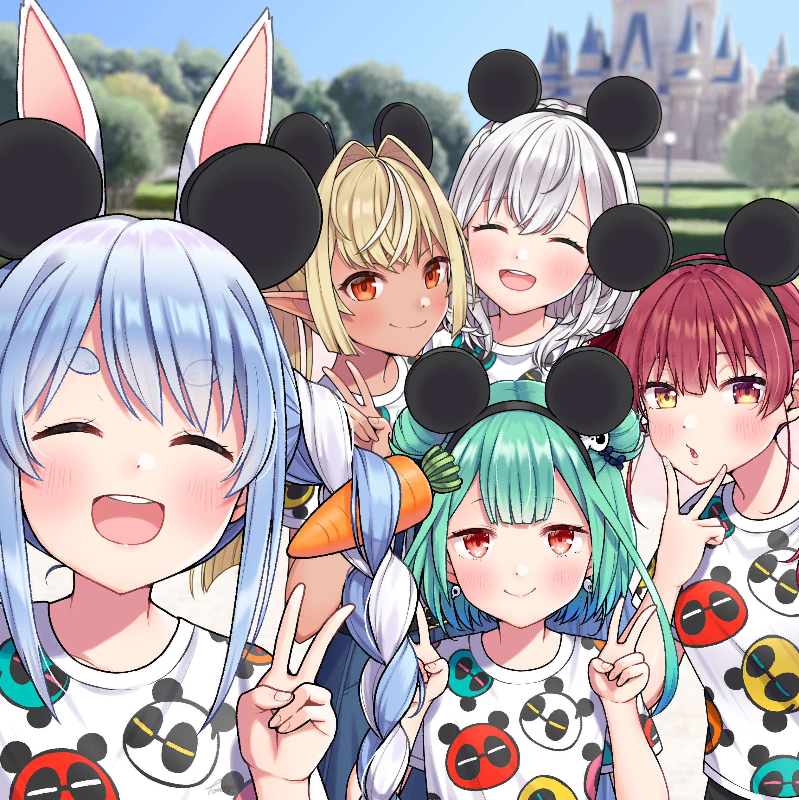

# Ascii Art

Convert regular images to ascii.

## Gallery

 

 

## Technologies

- [Python3](https://www.python.org/)
- [Pillow](https://python-pillow.org/) v8.1.0

## Usage

Make sure to install the requirements first.

To generate ascii image, run `python asciiart.py path/to/image`. This will only generate the image
but does nothing.

To display the image, run `python asciiart.py path/to/image -d`.

To save the image, run `python asciiart.py path/to/image -o path/name.png`. You can use `jpg` for
the extension but it is recommended to use `png` for lossless compression.

You can also add configuration when generating the ascii image.

Running `python asciiart.py path/to/image -q low` will resize the main image around 144px.
This will create a much smaller ascii image file size and speeds up the generation process.
You can use `low` = 144px, `medium` = 480px, `high` = 720px, or `normal` = main image size.
Make sure to add the desired quality after the `-q` argument.
If quality is not set, it will use the default setting which is `medium`.

Set the custom ascii characters used by running `python asciiart.py path/to/image -c "$-."`.
The ascii image generated will only contain the specified ascii characters.
Just add the desired characters after the `-c` argument as a string `""`.
Also, remember to use `\` (backslash) for escape characters.
